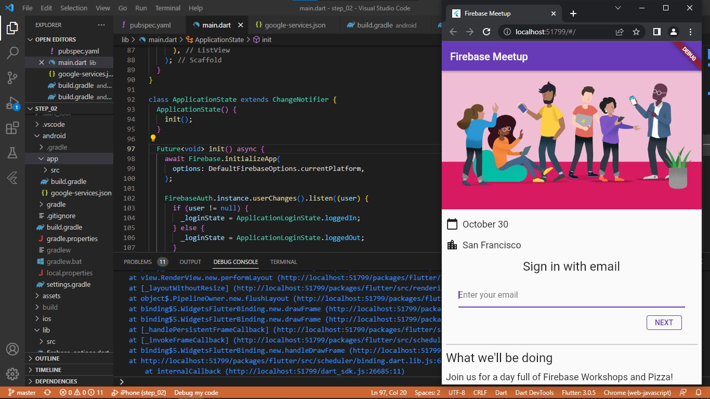
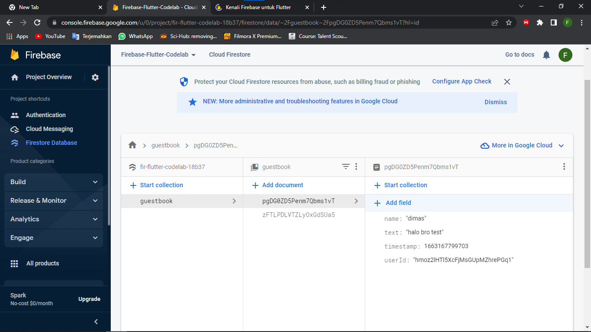
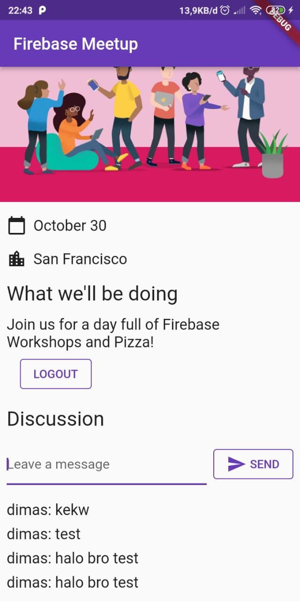

# Praktikum Firebase 2
Membuat aplikasi obrolan RSVP dan buku tamu acara di Android, iOS, Web, dan macOS menggunakan Flutter. mengautentikasi pengguna dengan Firebase Authentication dan menyinkronkan data menggunakan Cloud Firestore.
## Step 1
melakukan clone repistory pada codelab. lalu mengimport folder step 2.
## Step 2
membuat proyek baru di firebase sekaligus pembuatan database 
## Step 3
melakukan konfigurasi firebase pada visual studio code dengan menggunakan perintah $ flutter pub add firebase_core , $ flutter pub add firebase_auth , $ flutter pub add cloud_firestore , $ flutter pub add provider. dilakukan juga perintah $ dart pub global activate flutterfire_cli untuk memasang flutterfire. selanjutnya melakukan konfigurasi flutterfire menggunakan perintah $ flutterfire configure
## Step 4
Penambahan login pengguna RSVP. pada step ini ditambahkan tombol RSVP yang apabila diklik maka akan dilanjut melakukan login dengan email, password dan nama.

## Step 5
pada step ini bertujuan untuk menambahkan fungsionalitas bagi pengguna untuk menulis pesan baru ke database.

## Step 6
selanjutnya menampilkan pesan, Anda harus menambahkan listener yang memicu saat data berubah, lalu membuat elemen UI yang menampilkan pesan baru. Anda akan menambahkan kode ke status aplikasi yang mendengarkan pesan yang baru ditambahkan dari aplikasi.

## Step 7
penambahan rules pada database

